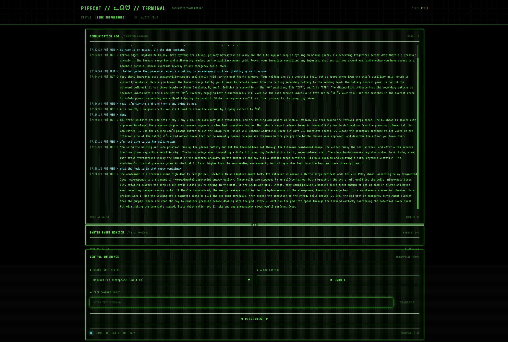

# Space Adventure Interactive Story - Voice Mode

You are the lone crew member on light transport ship *Gradient Ascent*. Your ship has suffered a catastrophic failure, cause unknown. Work with the ship's AI to diagnose the failure and make it safely to a station or planet.

The entire game runs locally, powered by gpt-oss, Whisper, Kokoro TTS, and Pipecat.



# Setup

## [gpt-oss](https://github.com/openai/gpt-oss)

You can use any chat completions endpoint to interface with gpt-oss. For a voice AI application like this, you'll want to set the reasoning level to "low". (The default is "medium".)

To run the model locally and set the reasoning level to "low", the [llama.cpp](https://github.com/ggml-org/llama.cpp) project's llama-server is a good option.

Download llama.cpp binaries or build the source. You'll also need to specify a system instruction template that sets reasoning to low. You can use the [gpt-oss-template.jinja](gpt-oss-template.jinja) file in this repo. (llama-server doesn't pass a reasoning level argument through from the API request to the chat template.)

Start the LLM server:

```
# small model
MODEL=ggml-org/gpt-oss-20b-GGUF
# big model
MODEL=ggml-org/gpt-oss-120b-GGUF

llama-server -hf $MODEL --verbose-prompt --chat-template-file gpt-oss-template.jinja --jinja --cache-reuse 128 -fa
```

## Pipecat voice bot 

```
cd server
python3.12 -m venv venv
source venv/bin/activate
pip install -r requirements.txt
```

## [voice-ui-kit](https://github.com/pipecat-ai/voice-ui-kit) React front end

```
cd client
npm i
```

## Run the bot and the front end

Terminal 1

```
cd server
source venv/bin/activate
python bot.py
```

Terminal 2

```
npm run dev
```

Load in browser: localhost:3000 (or whatever port `npm run dev` chose)


